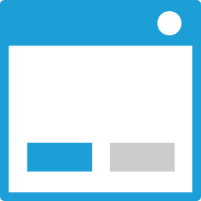
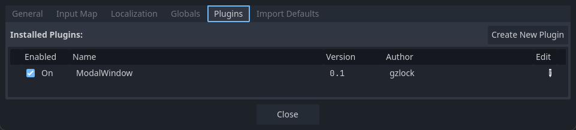
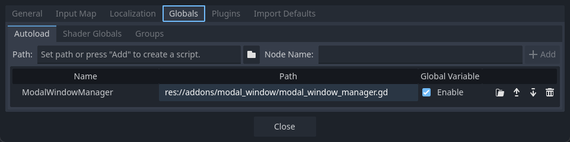

# Godot Modal Window v0.1 / [中文](./README_cn.md)

## Developer-Friendly Features
* Supports stacked multiple windows
* Allows enabling/disabling background click to close the window
* Supports method chaining, e.g., `win.a().b().c()`
* Fully customizable window UI skins
* Button events can be captured via signals
* Supports `await` to wait for the modal window to close, e.g.,

  ```
    await win.wait_to_close()
    print("The window has closed")
  ```

## Gamepad-Friendly Features
* Automatically switches button focus between multiple windows
* Allows developers to manage focus manually

## 🎉 Experience the Best Practices 🎉

**Download this project locally and run the example scene.**

## Installation

* Download the [🔗latest stable version plugin zip](https://github.com/gzlock/gd_modal_window/releases/latest/download/modal_window.zip), extract it, and place it in the Addons folder of your Godot project, e.g., `/project/addons/modal_window`
* Search for "Modal Window" in the Godot editor's Asset Library to install

## How To Use

1. Enable the ModalWindow addon



2. Enable the ModalWindowManager in the global settings



3. Create a window using `ModalWinddowManager.create('Content', 'Title')`

# Two Ways to Customize Window Styles
1. Globally

    `ModalWindowManager.global_preset = ...`

2. For a single window

    `ModalWindowManager.create('content', 'title', packed_scene)`

## Supported Platforms
* Web
* Windows
* Linux
* Android
* iOS

## ⚠️ Please refer to the [🔗Custom Preset Scene](./custom_modal_window_preset.tscn) for the node naming conventions to create custom window scenes.

## Assets 
* [Kenny UI Pack (CC0)](https://kenney.nl/assets/ui-pack)
* [Ninja Asset Pack (CC0)](https://pixel-boy.itch.io/ninja-adventure-asset-pack)
* [Pixelated Elegance Font - CC0](https://ggbot.itch.io/pixelated-elegance-font)

## TODO
* Write documentation