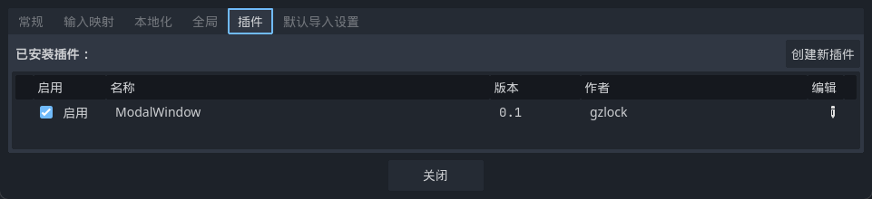
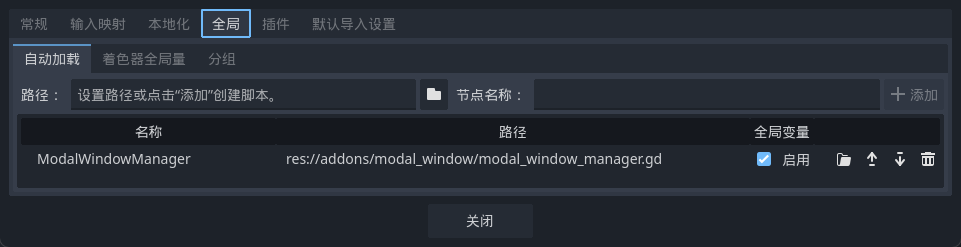

<p align="center">


# Godot模态窗口 / [English](./README.md)

</p>

## 开发者友好
* 支持 多窗口堆叠
* 支持 启用 / 禁用点击背景关闭窗口
* 支持 链式调用，例如`win.a().b().c()`
* 支持 完全自定义窗口UI皮肤
* 支持 通过信号获取按钮事件
* 支持 await等待模态窗口关闭，例如

  ```
    await win.wait_to_close()
    print("窗口已经关闭")
  ```


## 用手柄的游戏玩家友好
* 支持 多个窗口之间的自动切换按钮焦点
* 支持 开发者自己管理节点焦点

## 🎉体验最佳实践🎉

**下载这个项目到本地，运行example场景即可。**

## 安装

* 下载[🔗最新的稳定版本插件压缩包](https://github.com/gzlock/gd_modal_window/releases/latest/download/modal_window.zip)，解压放到Godot项目的Addons文件夹，例如`/项目/addons/modal_window`
* 在Godot编辑器Asset Library内搜索Modal Window进行安装

## 使用方法

1. 启用ModalWindow插件



2. 启用全局设置里的ModalWindowManager



3. 创建窗口`ModalWinddowManager.create('窗口内容','窗口标题')`


# 两种方法自定义窗体风格
1. 全局

    `ModalWindowManager.global_preset = ...`

2. 针对单一窗口
   
    `ModalWindowManager.create('content', 'title', packed_scene)`


## 支持平台
* Web
* Windows
* Linux
* Android
* iOS

## ⚠️请参照[🔗示范的预设场景](./custom_modal_window_preset.tscn)的节点命名规范来创建自定义窗口场景

## Assets 
* [Kenny ui pack(CC0)](https://kenney.nl/assets/ui-pack)
* [Ninja Asset Pack(CC0)](https://pixel-boy.itch.io/ninja-adventure-asset-pack)
* [Pixelated Elegance Font - CC0](https://ggbot.itch.io/pixelated-elegance-font)

## TODO
* 编写文档
